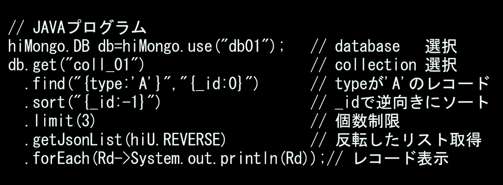

# hiMongo : mongoDB-JAVA-driver wrapper
### mongo-shell-like simple [API](https://hiuric.github.io/hiMongo/) as below.

click [this](https://hiuric.github.io/hiMongo/) to see [API](https://hiuric.github.io/hiMongo/)-javadoc.
### user class mapping (read)
```
class MyRecord {
   String   type;
   double   value;
   Date     date;
   }
-----
// get last 3 type-A documents as Record-class list.
hiMongo.DB     db=hiMongo.use("db01");
List<MyRecord> recs
=db.in("coll_01")
   .find("{type:'A'}","{_id:0}")
   .sort("{_id:-1}")
   .limit(3)
   .getClassList(MyRecord.class,hiU.REVERSE);
for(MyRecord rec:recs){
   System.out.println("value="+rec.value);
   }
```
### user class mapping (write)
```
class MyRecord {
   String   type;
   double   value;
   Date     date;
   }
-----
hiMongo.DB         db   = hiMongo.use("db01");
hiMongo.Collection coll = db.in("coll_01")
MyReord rec = new MyRecord();
rec.type  = "D";
rec.value = 12.3;
rec.date  = new Date();
coll.insertOne(rec);
```
### recursive access to db
hiMongo application can access the DB recursively with a reference definition.
```
import hi.db.hiMongo;
public class Test { 
   public static void main(String[] args_){
      hiMongo.DB db=hiMongo.use("db01");
      db.in("famiryTree")
        .find("{name:{$in:['P0027','P0028','P0029','P0030','P0031']}}")
        .forEachRecursive(
            "{#CUR.father:name,#CUR.mother:name}" // reference definition
           ,Fr->{ // main lambda. recursivelly called
               if( "KING".equals(Fr.get("#CUR.status")) ) {
                  return Fr.disp(" is a descendant of KING #CUR.name");
                  }
               return null;
               }
           ,Ff->{ // finished with result (found)
               System.out.println(Ff.disp("#TOP.name")+Ff.disp("#RESULT")+".");
               }
           ,Fn->{ // finidhed with no result (not found)
               System.out.println(Fn.disp("#TOP.name is not."));
               }
            )
         ;
      }
   }
// record Schema {'name':'P0017', 'status':'-', 'father':'P0009', 'mother':'P0010'}
```
### extended JSON input;comment,document array without bracket,ETC.
```
// 作曲家リスト
// 出生国と異なる国に移住し活躍した場合はnationalityに
// 出生国,移住国の順で記述
// ご存命の場合はlifeTimeに出生年のみ記述
{famiryName:'Bach',givenName:['Johann','Sebastian'],
 nationality:['独'],lifeTime:[1685,1750]}
{famiryName:'Bartók',givenName:['Béla'],
 nationality:['ハンガリー','米'],lifeTime:[1881,1945]}
{famiryName:'Beethoven',givenName:['Ludwig','van'],
 nationality:['独'],lifeTime:[1770,1827]}
{famiryName:'Brahms',givenName:['Johannes'],
 nationality:['独'],lifeTime:[1833,1897]}
{famiryName:'Chopin',givenName:['Frédéric-Françoic'],
 nationality:['ポーランド','仏'],lifeTime:[1810,1849]}
```
### run sample programs, test and rebuild library
```
このフォルダはhiMongoのビルド環境および試験環境(Linux/Windows)です。
Javaは8以上が必要です。
サンプル/試験はmongoDBサーバーがローカルに動作していることを前提としています。

|-- run_this_to_set755.sh .shに実行パーミションを付加するスクリプト
|-- configure  サンプル、試験、ビルドの共通設定
|   `-- configure.sh
|-- docs       hiMongo-jdoc
|   |-- index.html
|   ...
|-- lib        使用ライブラリおよびhiMongoライブラリ
|   |-- hiMongo_0_08.jar
|   |-- hiNote_3_10.jar
|   `-- mongo-java-driver-3.12.5.jar
|-- sampleSet  サンプルセット
|   |-- 01simpleAccess
|   ...
|   |-- configure.sh
|   `-- run.sh
|-- src        ソース
|   |-- A00_clear.sh
|   |-- A01_build.sh
|   |-- A09_javadoc.sh
|   |-- hiMongo.java
|   ...
|   `-- hi_style.css
`-- testSet     試験セット
    |-- test_data     試験データ生成スクリプト
    |-- test01_last3  
    ...
    |-- configure.sh
    `-- test.sh
(Windows用に各.shと同等の機能を持つ.batも置かれています）

hiMongoライブラリは予めビルドされた形でlibに置いてあります。
lib/hiNote_3_10.jarとlib/mongo-java-driver-3.12.5.jarは
本来は正式な公開元からダウンロードすべきものですが、簡便化
とバージョン安定化のため、置きました。
mongo-java-driver-3.12.5.jar:
   https://mongodb.github.io/mongo-java-driver/
hiNote_3_10.jar:
   http://www.otsu.co.jp/OtsuLibrary/

＝＝＝＝＝ 実行権限の付与(Linuxの場合のみ)＝＝＝＝＝ 
展開後最初に一度だけ
   sh run_this_to_set755.sh
を実行し、全フォルダの.shに実行権限を与えます


＝＝＝＝＝ sample実行 ＝＝＝＝＝ 
sampleSetの各ディレクトリで
   ./run.sh  Linux
   run.bat   Windows 
を実行するとサンプルが動きます。
標準エラーは各ディレクトリのmon.logに出ます。
sampleSet直下の./run.shで全サンプルが動きます


＝＝＝＝＝ 試験実行 ＝＝＝＝＝
testSetの各ディレクトリで
   ./test.sh  Linux
   run.bat    Windows
実行すると試験プログラムが動きます。
結果は予め置かれてあるリファレンスと比較し異なる場合は
エラーとなります。
標準エラーは各ディレクトリのmon.logに出ます。
testSet直下の./test.shで全テストが動きます。ただし、
TEST10_remote/は環境依存なので、予めコメントアウトする
必要があります。

試験は３つのモードがあります。
./test_00_DirectMode.sh  : mongo-java-driverの直呼び
./test_00_WorkerMode.sh  : Caler/Workerモデル
./test_00_ServerMode.sh  : socke通信でサーバを呼ぶ
ServerMode実行にはlocalhostで
../bin/simpleServ.sh
を起動しておく必要があります
.sh上のlocalhostを他ホストのipアドレスに変えると
他ホストと接続することもできます。

＝＝＝＝＝ ライブラリのリビルド ＝＝＝＝＝
hiMongoライブラリをビルドしなおすには
   src/
下で
   ./A01_build.sh Linux
   A1_build.bat   Windows
を実行します。
lib/下に.jarが置かれます。

docsを作り直すには
   src/
下で
   ./A09_javadoc.sh  Linux
   A09_javadoc.bat   Windows
を実行します。
../docs/下にドキュメントが作られます。

注意:Linuxの場合
        /var/www/html/hiMongo/
     下にもコピーが作られます。
     不要の場合A09_javadoc.shの最終行を#コメントアウト
     してください 
     Windowsの場合
        C:\xampp\htdocs\hiMongo\
     下にもコピーが作られます。
     不要の場合B09_javadoc.batのxcopy行を::コメントアウト
     してください 
```
